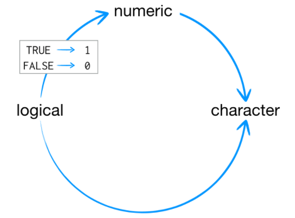

```{r setup, include=FALSE}

options(
  htmltools.dir.version = FALSE,
  servr.interval = 0.5
  )


knitr::opts_chunk$set(
  fig.width=9, fig.height=3.5, fig.retina=3,
  out.width = "100%",
  cache = FALSE,
  echo = TRUE,
  message = FALSE,
  warning = FALSE,
  hiline = TRUE
)
```


```{r xaringan-setup, eval=FALSE, include=FALSE}

if (!requireNamespace("xaringan")) remotes::install_github("yihui/xaringan")

xaringan::inf_mr() # real time previewer


if (!requireNamespace("remotes")) install.packages("remotes")

if (!requireNamespace("xaringanthemer")) remotes::install_github("gadenbuie/xaringanthemer")

library(xaringanthemer)

style_duo_accent(
  primary_color = "#1381B0",
  secondary_color = "#FF961C",
  inverse_header_color = "#FFFFFF"
)

if (!requireNamespace("knitr")) install.packages("knitr")


```


```{r packages-to-run-code-properly, include=FALSE}
library(knitr)

```


> &#x1F48A; **LINGUAGEM E AMBIENTE DE DESENVOLVIMENTO VOLTADO PARA CÁLCULOS ESTATÍSTICOS E DESENVOLVIMENTO GRÁFICO**


--
Se você tem dois monitores, ou um computador extra, recomendo que você tente reproduzir os códigos você mesmo durante a conversa!


--

### Particularidades do R

- **O ambiente executa "linhas", sequenciais e condicional **
- Operações com objetos mantidos na memoria em seção interativa
- Não é necessário compilar o script (dinamismo) nem caractere especial ";"
- Funcionalidades por funções internas e criadas pelo usuário
- Funções básicas são mantidas na base do sistema
- Podem ser adicionadas novas funções atrvés de pacotes
- Pacotes podem ser baixados e prontamente disponíveis off-line
- Cada função possui seu próprio nome
- Usa o padrão internacional para data (YYYY-MM-DD)
- Caracteres latinos (UTF-8) e marcador de [decimal e milhar](C:/Program Files %28x86%29/Microsoft Office/root/Office16/EXCEL.EXE) internacional


---
# Motivação pessoal


---
class: inverse center middle

# Hands on!


---
# Instalando o R

No [**YouTube**](www.youtube.com/watch?v=8LnZNC4hxdQ) você pode encontrar exemplos do passo a passo para instalação dos softwares R e RStudio

* **R**: *<https://cran.r-project.org/>*

* **RStudio** *<https://www.rstudio.com/products/rstudio/download/>*

## CRAN

**CRAN - The Comprehensive R Archive Network** é uma rede de servidores ftp e web em todo o mundo que armazena versões idênticas e atualizadas de [**código e documentação para R**](https://cran.r-project.org/). 


---
# RStudio

* **control+enter:** executa a linha selecionada  
* **control+shift+enter:** executa o script atual (com _echo_)  
* **control+shift+s:** executa o script atual (sem _echo_)  
* **control+shift+b:** executa do início até a linha atual  
* **control+shift+e:** executa oda linha atual até o final


--
*   [FiraCode](https://github.com/tonsky/FiraCode) é uma fonte monoespaçada com ligaduras


--
*   `Tools > Global options` (Cores; Layout; code completation)

--
*   Varinha mágica


--
*   Pacotes


---

# Pacotes

* Pacotes são **coleções de funções R**, dados e código compilado 
* Quando você instala o R, ele já vem com um conjunto padrão de pacotes
* A comunidade contribui e disponibiliza novas funcionalidades
* O caminho (`path`) dos pacotes é chamado de biblioteca (`library`)
* Depois de instalados, precisam ser carregados na sessão para serem usados

> **P.S. se você reabrir a seção, precisa chamar os pacotes novamente!**

```{r packages-fortune, eval=FALSE}
install.packages("fortunes")

x <- fortunes::fortune(10)
```


---
# Outras fontes de pacotes

```{r github-packages, eval=FALSE}
# Mantenha os pacotes no início dos scripts!
install.packages("devtools")
library(devtools)

install_github("hadley/ggplot2")

install.packages("C:/Users/caioc/Downloads/A3_1.0.0.tar.gz", 
                 repos = NULL, 
                 type='source', 
                 lib="C:/Users/caioc/AppData/Local/R/win-library/4.2")

setRepositories(ind = c(1:8))
```


---
# pacman

> <p style="font-size:25px"> 
&#x1F48A; Existe um pacote que facilita lidar com pacotes, <br/> instalando e chamando-os ao mesmo tempo!
<p/>

```{r gold-pacman}
if (!requireNamespace("pacman", quietly = TRUE))
  install.packages("pacman")

pacman::p_load(openxlsx, tidyverse)
```


---
# Obtendo ajuda


As seguintes formas de ajuda podem ser obtidas no R:  
* Iniciar ajuda padrão – `help.start()`  
* Obter ajuda sobre uma função X – `help(X)` ou `?X`  
* Se for sobre um caracter X qualquer como [[ – `help("[[")` ou `?"[["`  
* Obter ajuda sobre um pacote Y – `help(package=Y)`  
* Procurar por uma estatística W em todos os pacotes instalados – `help.search(“W”)` ou `??W`  
* Procurar objetos com um determinado nome Z – `apropos(“Z”)`  
* Mostrar exemplos da função Q – `example(Q)`  
* Listar as funções e operações contidas no pacote base – `ls(“package:base”)`  
* [*StackOverflow*](https://stackoverflow.com/questions/tagged/r)
* [*R-br*](http://r-br.2285057.n4.nabble.com/)
* [*BioStars*](https://www.biostars.org/) 
* [Como fazer uma pergunta](https://stackoverflow.com/help/asking)


---
class: inverse center middle

# <p style="font-size:100px">&#x1F503;Feche o RStudio</p> 


---
# Projetos


* Você foi questionado se desejava salvar seu script e os dados da memória
* Os dados da memória sumiram se não foram salvos
* O R irá procurar os dados salvos em "Meus Documentos/.RData" e realocar na memória
* Todos os pacotes chamados foram desligados (`detach`)

Vantagens 
* Evitar usar a função `setwd()`
* Evitar confusão com objetos de outros scripts/ambientes 

.pull-left[
#### salva memória inteira
```{r, eval=FALSE}
# no início do script
load("file.RData") 

# no final do script toda memória
save(file = "file.Rdata")
```
]

.pull-right[
#### salva um objeto
```{r, eval=FALSE}
saveRDS(x, file = "tabela_x.RDS")

x <- readRDS("tabela_x.RDS")
```

]


---
# Criando objetos na memória

```{r creating-objects}
x <- c(5, 2, 5, 6, 1, 8)
x2 <- c(1, 2)
y <- "string"
verdadeiro <- TRUE
```

O que dificulta a curva de aprendizado de iniciantes é por não saber qual o tipo de objeto que uma função espera, ou o tipo de objeto que ela retorna


---
# Vetores Atômicos

Um vetor atômico é apenas um simples vetor de dados, com apenas uma dimensão (como se fosse somente uma coluna de uma tabela do excel), e **contém também apenas um tipo de dado**, por exemplo, somente números, ou somente texto, ou somente fatores, etc... 

.pull-left[
#### "character"
```{r}
naipes <- c("paus", "copas", "espadas", "ouros")
is.vector(naipes)
typeof(naipes)
```
]

.pull-right[
#### Tipos de dados
* Character (string)
* Integer
* Numeric
* Logical (Boolean)
* POSIX (date)
* Factor
]

O R reconhece seis tipos básicos de vetores atômicos: **doubles** , **integers** , **characters** , **logicals** , **complex** e **raw**.


---
## Matrizes

* É um caso especial de um vetor atômico (Vetor bidimensional)
* Mantendo a propriedade de apenas um tipo de dado

```{r}
matriz.naipes <- matrix(naipes, nrow = 2)
# repare o preenchimento por coluna em vez de linha

dim(naipes) <- c(2, 2)

naipes
```

* Repare que você pode criar uma matriz com a função `matrix()`, ou alterar um atributo de um vetor atômico
* Quando adicionamos mais uma dimensão ao vetor, ele se tornou uma matriz
* Se adicionarmos mais do que duas dimenões ele se tornará um **array (uma matriz n-dimensional)**.

E se você precisar criar uma matriz que contém mais de um tipo de dado?


---
## data.frame

* cada coluna é um vetor atômico que pode ter um tipo de dado diferente, **mas todos com o mesmo comprimento**.


---

```{r}
naipes <- c("paus", "copas", "espadas", "ouros")
numeros <- 1:13

baralho <- data.frame(numeros, "naipe" = rep(naipes, each = 13))

head(baralho)
```

E se eu precisar agrupar dados (vetores), de comprimentos diferentes? com n dimensões? ou mesmo vários data.frames?


---
## Listas

* Agrupam objetos R em um conjunto unidimensional

```{r}
list1 <- list(baralho, 13:22, "R", list(TRUE, FALSE))
```


---
# Importando dados de fora do R

## .txt e .csv

```{r txt-csv-import}
x <- read.table(file = "D:/R Zone/_Cuso R/Apoio/ex_NA_tab_coma.txt", 
                header = T, 
                sep = "\t", 
                dec = ",",
                na.strings = c("NA", "-9", ".", ""))
```

> &#x1F48A; Repare que após a vírgula posso colocar o resto dos argumentos na próxima linha, e que a barra é invertida quando se usa o sistema operacional windows


---

.pull-left[
### no arquivo:


]

.pull-right[

### objeto do R:

```{r coerction}
x
```

]

- Como a função lidou com o nome das colunas? 
  - espaços > . 
  - nome inválido > prefixo "x" 
* Como é tipo de dado de cada coluna? 


---
# Coerção

```{r data-frames-coerction}
str(x)
```

* Se um caracter de texto (string) estiver presente em um vetor atômico, R converterá todo o resto do vetor em texto. 
* Se um vetor contiver apenas lógicos e números, o R irá converter os lógicos em números 
  - TRUE se torna 1 e FALSE se torna 0


> &#x1F48A; Se houver um outro caracter de dado perdido (omisso) em uma observação em uma coluna, e esse não for passado no argumento `na.strings = c("NA", "-9", ".", "")` toda a coluna será convertida para texto


---

.pull-left[

]

.pull-right[
#### Sequência de coerção por tipo de dado
1. **Logical (boolean)**

2. **Numeric**

    2.1 Numeric (**integer**)
    
    2.2 Numeric (**double**)

3. **POSIX (date)**

4. **Character (string)**

5. **Factor (strings com classes)**
]


---
# .xlsx

```{r excel-import}
urldados <- "https://github.com/CAIOAGRO0/data-science-for-babies/blob/main/exemplo_dataframe.xlsx?raw=true"

x <- read.xlsx(urldados, sheet = "2016", na.strings = c("-9", ".", "NA", ""))

x_backup <- x

head(x)
```

> &#x1F48A; Você pode importar um arquivo que está salvo na nuvem!


---
# Operadores

* Algumas funções tem comportamento como operadores

```{r operadores-logicos}
is.na(x[1,6])

x[1,6] == "-9"


x[26, 7] < 150
```


> &#x1F48A; O resultado é sempre um vetor de verdadeiro (`TRUE`) e falso (`FALSE`), muito usado dentro de `ifelse()` aninhado à `mutate()`


---
## Lógicos


|    OPERADOR         |          DESCRIÇÃO          |
|---------------------|:---------------------------:|
|    <                |        Menor que...         |
|    <=               |    Menor   ou igual a...    |
|    >                |         Maior que...        |
|    ==               |    Igual a...               |
|    !=               |    Diferente de...          |
|    !                |    Negação                  |
|    X &#124; Y  <br/> X &#124;&#124; Y          |    X ou Y                   |
|    X & Y  <br/>  X && Y       |    X e Y                    |
|    IsTRUE(x)        |    x é verdadeiro?          |


> &#x1F48A; Operadores denominados "_short-circuit_" `&&` e `||` são muito mais utilizados dentro de estruturas de controle como o `if(), ifelse(), for()`


---
.pull-left[
## Aritméticos

```{r}
x$massa[26] + x[26, "1comp"]
```


|    OPERADOR    |       DESCRIÇÃO       |
|----------------|:---------------------:|
|    +           |         Adição        |
|    -           |       Subtração       |
|    *           |     Multiplicação     |
|    /           |    Divisão            |
|    ^ <br/> **  |    Exponenciação      |
|    %/%         |    Divisão inteira    |
|    %%          |    Módulo             |

]

.pull-right[
## Especiais

|    OPERADOR                   |     DESCRIÇÃO     |
|-------------------------------|:-----------------:|
|    $                          |     Componente    |
|    [ ] <br/> [[ ]]            |    Indexadores    |
|    :                          |     Sequência     |
|    ~                          |    Fórmula        |
|    <- <br/>   <<- <br/>    = <br/>    -> <br/> ->>    |    Atribuição     |
|    ?                          |    Ajuda          |

]


---
class: inverse center middle

# <p style="font-size:100px"> E o que acontece se forem somados dois objetos de tamanhos diferentes?</p>


---
## Funções numéricas

| OPERADOR              |          DESCRIÇÃO          |
|-----------------------|:---------------------------:|
| length()              | Num. elementos              |
| max(), min(), range() | Máximo, mínimo e amplitude  |
| which,max()           | Índice do maior valor       |
| which.min()           | Índice do menor valor       |
| summary()             | Resumo                      |
| sample()              | amostragem aleatória        |
| round(x, n)           | Arredondamento              |
| log(x, n)             | Logaritmo natural           |
| seq(de, para, por)    | Sequencia                   |
| rep(x, times = )      | Repita x tantas vezes       |


---
## Funções alfa

|    OPERADOR                              |              DESCRIÇÃO              |
|------------------------------------------|:-----------------------------------:|
|    substr(x,   start = , stop = )        |    Extrair ou substituir strings    |
|    grep(padrão, x, ignore.case =   F)    |         Procura padrão em x         |
|    sub(padrão, x, substituição)          |       Substitui um padrão em x      |
|    strsplit(x, split)                    |    Separa os elementos por split    |
|    paste(..., sep = “”)                  |    Concatene separando por...       |
|    toupper()                             |    Para maiúsculas                  |
|    tolower()                             |    Para   minúsculas                |


Grande parte do trabalho repetitivo dessas funções "básicas" foram envelopadas em **verbos no tidyverse**


---
# Tidyverse

* O [tidyverse](https://www.tidyverse.org/) é uma coleção de 8 [pacotes](https://www.tidyverse.org/packages/) projetados para ciência de dados
* Todos os pacotes compartilham uma filosofia de design, gramática e estruturas de dados em comum
* Manipular, resumir e visualizar dados é essencial em Data Science
* Conhecer os dados é obrigatório para insights e concluões (modelagem)
* A prática trará proficiência para: 
  * Conhecer os métodos mais utilizados para cada tipo de variável
  * Conhecer os verbos, entradas e saídas


```{r}
x %<>% 
  mutate_at(c("ano", "bloco", "gen", "pl", "rep"), as.factor) %>% 
  as_tibble()
```

* **Verbos:** mutate(), select(), filter(), arrange(), rename(), summarise()
* **Sufixos:** _at(), _if(), _all()
* **Agrupamento:** group_by() e ungroup()
* **Junções:** inner_join(), full_join(), left_join() e right_join()
* **Funções resumo:** n(), n_distinct(), first(), last(), nth()


---
class: inverse center middle

# <p style="font-size:100px"> [Operador infixo Pipe](https://en.wikipedia.org/wiki/Infix_notation) <br/>`%>%` <br/>`|>` <br/>
</p>

.footnote[

[1]  pacote **magrittr**

[2]  **nativo** (requer R 4.1+)

]

---
# Pipe

.pull-left[
```{r sem-pipe}
x$cor.polpa[x$cor.polpa == "-9"] <- NA

y <- subset(x, !is.na(x$cor.polpa) & !is.na(x$massa))
y$ano <- NULL
y$bloco <- NULL
y$gen <- NULL
y$pl <- NULL
y$rep <- NULL
y$`1comp` <- NULL

z <- tapply(y$massa, y$cor.polpa, mean)

x$cor.polpa[x$cor.polpa == "v"] <- "V"
```

]

.pull-right[
```{r com-pipe}
pacman::p_load(magrittr)

x <- x_backup

x %<>%
  mutate(cor.polpa = ifelse(cor.polpa == "-9", NA, cor.polpa),
         cor.polpa = ifelse(cor.polpa == "v", "V", cor.polpa))

media_cor <- x %>%
  filter(!is.na(cor.polpa) & !is.na(x$massa)) %>%
  select(cor.polpa, massa) %>% 
  group_by(cor.polpa) %>% 
  summarize(media = mean(massa))
```
]

---
# Pipe

- Evitar chamadas de funções aninhadas (uma função dentro de outra)
- Minimizar a necessidade de criar muitos objetos e definições de funções 
- Facilitar a adição de etapas com fluidez e fácil de interpretar.  

### placeholder `"."` 

.pull-left[
#### fórmula no 1&deg; argumento
```{r placeholder-pipe, eval=FALSE}
lm(massa ~ cor.polpa, data = x)
```
]

.pull-right[
#### equivalente com placeholder
```{r no-placeholder-pipe, eval=FALSE}
x %>%
  lm(massa ~ cor.polpa, .)
```
]

> &#x1F48A; `.x`    é uma variante do placeholder que passa as observações como parâmetro dem vez do data.frame inteiro

---
### placeholder `"."` 

```{r, eval=FALSE}
x %>% 
  plot(.$massa, .$`1comp`)
```

mas o que na verdade acontece é:

```{r, eval=FALSE}
plot(x = x, y = x$massa, type = x$`1comp`)
```

A maneira de obter o `pipe` para fazer o que queremos na função `plot()` é usar sua sintaxe de chaves `{}`. Ao envolver o lado direito entre chaves, podemos substituir a regra em que o lado esquerdo é passado para o primeiro argumento:

```{r, eval=FALSE}
x %>% {plot(.$massa, .$`1comp`)}
```

porém existe outro pipe que resolve isso pra gente!

---
# Exposition Pipe 
## %$%

Existem funções em que não se passa todo o conjunto de dados, mas somente algumas variáveis dos dados. 


.pull-left[
```{r pipe-var-fail, eval=FALSE}
x %>% {plot(.$massa, .$`1comp`)}
```
]

.pull-right[
```{r pipe-var, eval=FALSE}
x %$%
  plot(massa, `1comp`)
```
]


```{r pipe_var2, eval=FALSE}
x %$%
  cor(massa, `1comp`, use = "pairwise.complete.obs")
```

---
class: center, middle


---
class: inverse center middle

# <p style="font-size:100px"> Pipe nativo <br/>`|>` <br/>
</p>

.footnote[
Requer R 4.1+
]

---
# `|>`


.pull-left[
#### magrittr
```{r, eval=FALSE}
x %>%
  head
```
]

.pull-right[
#### nativo
```{r, eval=FALSE}
x |>
  head()
```
]

> &#x1F48A; Você precisa incluir a função como uma chamada de função, o que significa anexar um **`()`** no final do nome da função, em vez de apenas seu nome. Se você tentar executar mtcars |> head sem o `()` no final, receberá um erro: **Error: The pipe operator requires a function call as RHS (right-hand side).**

<p style="font-size:30px">Pronto, isso é tudo que o pipe nativo faz! Usa o LHS como primeiro argumento no RHS. Não há opção de placeholder, chaves, nem pipe de exposição.
</p>


---
# Função anônima (LAMBDA)

Se você quiser fazer qualquer coisa além de canalizar o LHS no primeiro argumento da função RHS, precisará da sintaxe de função anônima especial.

Elas não são funções nomeadas de um pacote ou escritas por você e armazenadas em um objeto de função. 

As funções anônimas são criadas dinamicamente, aplicadas imediatamente e não persistem após serem usadas: **`function(x) {}`**.

.pull-left[
#### function(x) {}
```{r, eval=FALSE}
function(x) {
  x[which.max(x$massa), ]
}
```
]

.pull-right[
#### a partir do R 4.1
```{r, eval=FALSE}
\(x) {
  x[which.max(x$massa), ]
}
```
]

O que você ganha escrevendo uma função anônima é que você consegue direcionar o tráfego declarando explicitamente as entradas e como elas serão usadas na função.


---
# Função lambda com pipe |>

> &#x1F48A; Você precisará envolver a função lambda em parênteses, e lembrar que precisa chamar um parênteses vazio na frente visto que **Error: The pipe operator requires a function call as RHS (right-hand side).**

```{r, eval=FALSE}
mtcars |> (anonymous-function-definition)()
```

```{r}
mtcars |> (\(x) {
   x[which.max(x$mpg), ]
})()
```

```{r}
mtcars |> (\(.) plot(.$hp, .$mpg))()
```

> &#x1F48A; Uma alternativa relativamente simples é **`mtcars |> with(plot(hp, mpg))`**


---
# Criando Funções

Não há uma função no pacote `base` que calcula a moda, então precisamos criar nossa própria função


.pull-left[
#### usando função lambda
```{r}
x %>% 
  select(massa) %>% 
  (\(x) {
  z <- table(as.vector(x)) 
  names(z)[z == max(z)]
})
```
]

.pull-right[
#### salvando a função
```{r}
# salvando a função num objeto
estatmoda <- function(x) {
  z <- table(as.vector(x)) 
  names(z)[z == max(z)]
}

x %>% 
  summarise(moda_massa = estatmoda(massa))
```
]

> &#x1F48A; Repare que ao usar uma função lambda com **`%>%`** não requer **`()`** no final, igual ao **`|>`**, apenas que a função lambda esteja entre **`()`**


---
# Usando nossa função em mais dados

```{r, error=TRUE}
x %>%
  summarise_all(list(estatmoda))

```

O que pode estar gerando esse erro? Que tal ler a mensagem e ir testando nossa função variável por variável? Vamos começar pela `ano` e depois da primeira em diante.

```{r}
x %$% 
  table(ano)

```


---
# Inserindo condições na função

Nossa função funcionou bem para o vetor `massa`, mas não com as demais, como melhorar nossa função?

```{r moda_melhorada}
moda<-function(x) { 
        if((is.numeric(x)==TRUE) && (is.list(x)==FALSE)) { 
                xx <- table(x) 
                valores <- which(xx==max(xx)) 
                vmodal <- 0 
                for(i in 1:(length(valores))) 
                        if(i==1) vmodal <- as.numeric(names(valores[i])) 
                                else 
                                vmodal <- c(vmodal, as.numeric(names(valores[i]))) 
                        if(length(vmodal) == length(xx)) 
                                print("conjunto sem valor modal") 
                                else return(vmodal) 
                } else print("o parâmetro deve ser um vetor ou uma matriz")}
```


---
# Funções

Função é um código que você escreve uma vez, mas quer usar ele várias vezes, e talvez até com algumas variações

A estrutura de uma função é dada abaixo:  

`myfunction <- function(arg1, arg2, ...) { statements return(object)}`  

.pull-left[
#### Definindo função
```{r}
maisum <- function(numero) {
  novo_numero <- numero + 1
  return(novo_numero)
}
```
]

.pull-right[
#### Usando função
```{r, eval=FALSE}
maisum(1)
maisum(maisum(1))
```
]

> &#x1F48A; Você pode visualizar o código de uma função digitando o nome da função sem o `()`ou `methods(estatmoda)` ou `getAnywhere(estatmoda)`. Salve uma função complexa em um arquivo separado, e depois importe a função na sua seção atual usando `source(função.R)`. 


---
# Estruturas de controle (loops)

Para não fazer um serviço repetitivo digitando um mesmo trecho de código várias vezes para objetos semelhantes, vamos deixar que o R aplique essas ações repetidas usando estruturas de controle com base em regras.

.pull-left[
#### Base R loop
```{r}
numero <- 0
while (numero < 5) {
  numero <- numero + 1
}
```
]

.pull-right[
#### purrr iteration C++ loop
```{r}
library(purrr)
map_dbl(1:5, function(numero) {numero + 1})
```
]

.pull-left[
#### core vector operation (C loop)
```{r}
numero <- 1:5
numero <- numero + 1
```
]

.pull-right[
#### Base R loop
```{r}
numero <- 0
for (i in 1:5) {
  numero <- numero + 1
}
```
]

> Se vc quer juntar colunas dentro de um objeto que está dentro de um loop, qual a diferença de juntar as colunas usando as funções `c()`, `cbind()`, `rbind()` ou `c_bind_cols()`?


---
# Estruturas de controle (loops)

### repeat

```{r}
repeat {
  numero <- rnorm(1)
  if (numero > 1) break
  cat(numero, "\n")
}

```

### apply (e suas variantes)

```{r}
apply(mtcars, MARGIN = 2, mean, na.rm = TRUE)
```


---
# Estruturas de controle (Condicionais)

Checa uma condição e decide qual código deve ser executado dependendo do resultado da condição checada


## if

**if** segnifica "se". Se algo for verdadeiro, faça uma tarefa. A sintáxe básica do `if` é:

`if(condição)expressão`

Se a condição de dentro do parênteses retornar um boleano `TRUE`, é executada a expressão logo à frente. Por exemplo:

```{r}
if (!require(pacman))install.packages("pacman")
```

> &#x1F48A; O resultado da condição é um `TRUE` ou `FALSE`. `if()` é muito útil dentro de funções


Mas, e se quisermos que seja executada outra tarefa se a condição dentro do parênteses retornar `FALSE`?.


---
### ifelse()

`ifelse(condição, se_verdadeiro, se_falso)`

```{r}
n.apostado = c(24, 32, 12, 15, 33, 58)
ifelse(n.apostado %% 2 == 1, "ímpar", "par")
```


### if else if else if else...

`if(condição1) expressão1 else if(condição2) expressão2 else expressão3 ... `

```{r}
if (sum(n.apostado %% 2 == 1) == length(n.apostado)/2) {
  cat("Metade são pares")
} else if (sum(n.apostado %% 2 == 1) < length(n.apostado)/2) {
  cat("Há mais números pares")
} else {
  cat("Há mais números ímpares")
}
```

---
## case_when (dplyr)

```{r}
if (sum(n.apostado %% 2 == 1) == length(n.apostado)/2) {
  cat("Metade são pares")
} else if (sum(n.apostado %% 2 == 1) < length(n.apostado)/2) {
  cat("Há mais números pares")
} else {
  cat("Há mais números ímpares")
}
```

```{r}
case_when(
  sum(n.apostado %% 2 == 1) == length(n.apostado)/2 ~ "Metade são pares",
  sum(n.apostado %% 2 == 1) < length(n.apostado)/2 ~ "Há mais números pares",
  TRUE ~ "Há mais números ímpares")
```


Muito útil para codificação de variáveis numéricas em classes por exemplo!

> &#x1F48A; As condicional dentro do if é unidimensional, então deve conter apenas um retorno booleano explícito ou derivado de uma expressão

---
### Condicional unidimensional

.pull-left[

|    OPERADOR         |          DESCRIÇÃO          |
|---------------------|:---------------------------:|
|    <                |        Menor que...         |
|    <=               |    Menor   ou igual a...    |
|    ==               |    Igual a...               |
|    !=               |    Diferente de...          |
|    !                |    Contrário de...          |
|    X &#124; Y       |    X ou Y                   |
|    X & Y            |    X e Y                    |
]

.pull-right[
```{r}
2 < 3 & 4 < 3
FALSE & TRUE
FALSE | TRUE
```

]

Dentro da condição pode haver combinações de expressões usando os operadores `| e &`, desde que o conjunto respeite a unidimensionalidade da condição.

> &#x1F48A; Combinando expressões, usando o **`&`** todos resultados devem ser **`TRUE`** para seguir, se o usar o **`|`** pelo menos um resultado deve ser **`TRUE`** para seguir.

